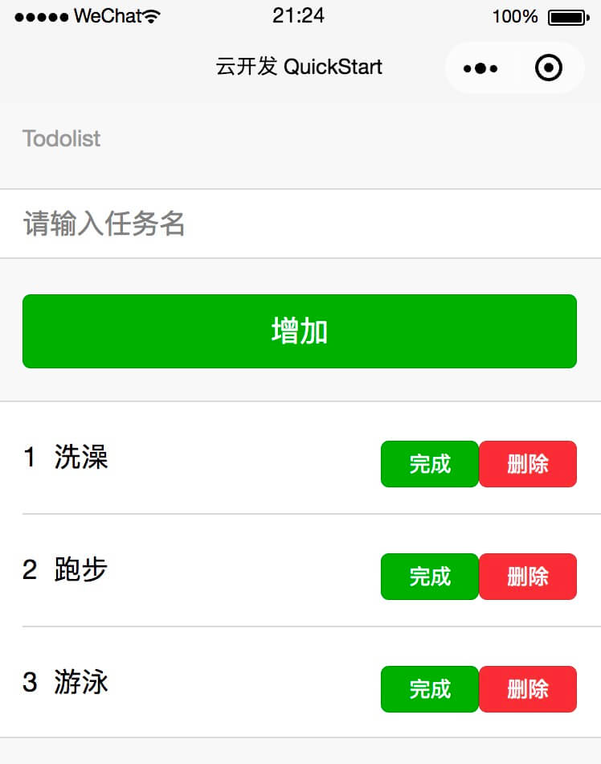

# 微信小程序 云开发 Todolist

本项目是微信开发者工具里“云开发快速启动模板”后，在此基础上增加代码，完成Todolist。

目的是为了学习微信小程序·云开发，达到一个人完成微信小程序前后端。

本项目代码涉及到微信小程序基础、前后台接口思想，如果你熟悉后台接口，相信看起来很轻松。

## 准备工作

1. 申请微信小程序账号，获得AppID
2. 新建项目，选择“云开发快速启动模板”，点击开发者工具顶部的“云开发”，按照提示开通
3. 官方建议创建两个环境，建议一个正式环境，一个测试环境。以下代码为了方便，全部为正式环境
4. 点击头部tab“数据库”，创建集合“Todolist”

## 增加云函数

在 cloudfunctions 文件夹上右键“新建 Node.js 云函数”，命名todoAdd，会提示安装npm包，安装即可

直接拷贝项目 cloudfunctions/todoAdd/index.js 代码，覆盖

选中 todoAdd 文件夹，右键“上传并部署”

另外三个 todolist、todoEdit、todoDel 方法同上

## 增加样式

复制 miniprogram/style/weui.wxss 文件到你项目里

在 miniprogram/app.wxss 里面增加代码 `@import 'style/weui.wxss';`

## 增加代码

复制 miniprogram/pages/index 文件夹到你项目里

-----

到此为止，一个基于小程序·云开发的微信小程序版Todolist就完成了，希望本项目对你有用。